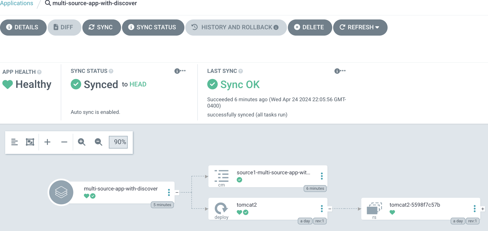

# Argo CD multi-source applications with CMP (config management plugin)

This repo contains some Argo CD applications to demonstrate how to configure 
multi-source apps to work with CMP.

## Project structure
* CMP plugin config files
  * the config map that defines the CMP plugin: `cmp/cmp-plugin-config.yaml`
  * the patch file for argocd-repo-server: `cmp/argocd-repo-server-patch.yaml`
```bash
└── cmp
    ├── argocd-repo-server-patch.yaml
    └── cmp-plugin-config.yaml
```

* user application files, including CMP marker files for plugin discovery. `source1`
  and `source2` can serve as the source individually for single-source Argo CD
  application, or jointly for multi-source Argo CD application.

```bash
├── apps
│   ├── source1
│   │   └── cmp-plugin-config.env
│   └── source2
│       └── tomcat2.yaml 
```

* Argo CD application manifest files, including both single-source and multi-source
  applications.

```bash
├── argo-apps
│   ├── multi-source-app-with-discover.yaml
│   └── single-source-app.yaml
```

## Install CMP as side-car container in argocd-repo-server
```bash
# switch to argocd namespace for convenience
kubectl config set-context --current --namespace argocd

# apply the CMP plugin config as a config map
kubectl apply -f cmp/cmp-plugin-config.yaml

# apply the patch to argocd-repo-server
kubectl patch deployments/argocd-repo-server --patch-file cmp/argocd-repo-server-patch.yaml

# verify CMP plugin and argocd-repo-server
kubectl get cm cmp-plugin-config
kubectl get deploy | fgrep argocd-repo-server
```

## Deploy a single-source Argo CD application with CMP
```bash
# apply the Argo CD application manifest
kubectl apply -f argo-apps/single-source-app.yaml

# verify application is deployed, and the configmap resource is generated by the CMP plugin.
# The configmap name is based on the value in the file located in `source1`, and the
# Argo CD application name.
kubectl get cm source1-single-source-app
kubectl get app single-source-app

# clean up
kubectl delete app single-source-app
kubectl delete cm source1-single-source-app
```
## Deploy a multi-source Argo CD application with CMP
```bash
# apply the Argo CD application manifest
kubectl apply -f argo-apps/multi-source-app-with-discover.yaml

# verify application is deployed, and the configmap resource is generated by the CMP plugin.
# The configmap name is based on the value in the file located in `source1`, and the
# Argo CD application name.
# This multi-source application also includes a tomcat deployment.
kubectl get cm source1-multi-source-app-with-discover
kubectl get app multi-source-app-with-discover
kubectl get pod

# clean up
kubectl delete app multi-source-app-with-discover
kubectl delete cm source1-multi-source-app-with-discover
```
The screenshot from Argo CD UI shows the Argo CD application `multi-source-app-with-discover`
is healthy and synced up correctly. It contains both the config map `source1-multi-source-app-with-discover`
generated by the CMP plugin, and the tomcat deployment from the 2nd application source.

